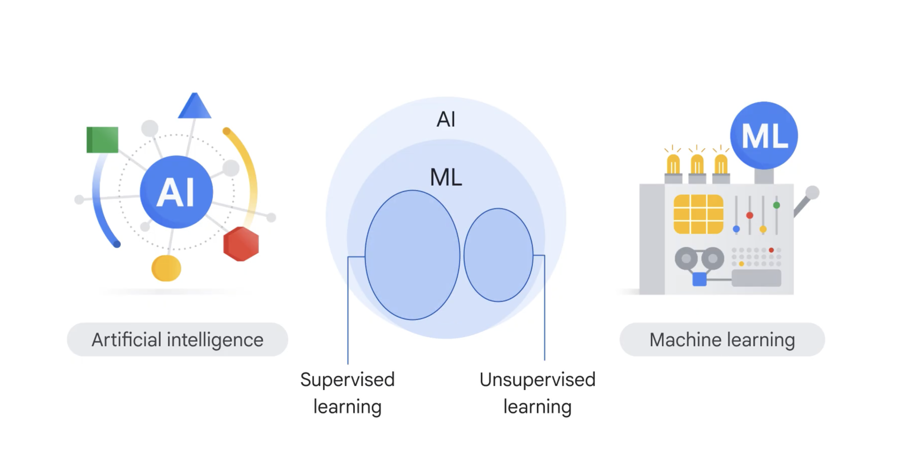
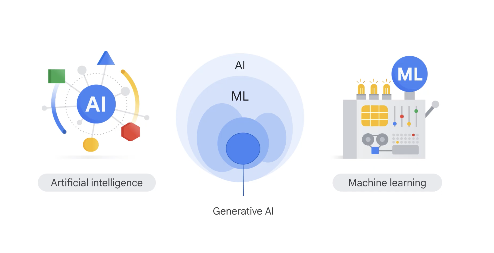
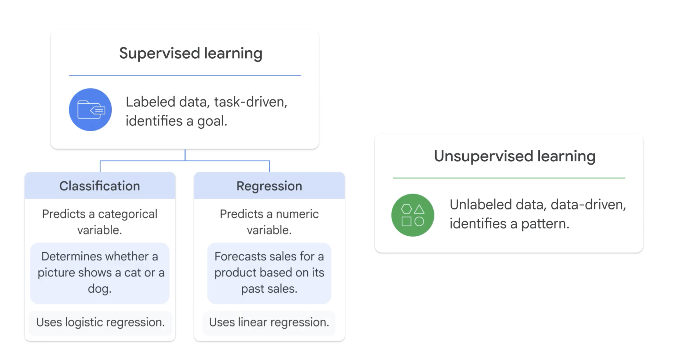
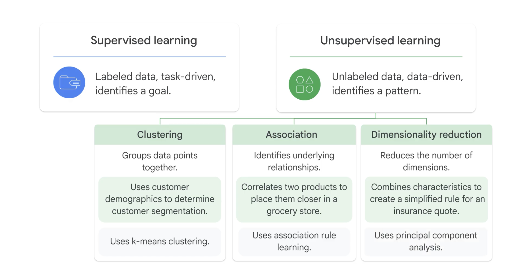

# AI Models
## 1. Terminology Hierarchy & Definitions

* **Artificial Intelligence (AI):** Broad umbrella term encompassing any system capable of mimicking human intelligence (e.g., robotics, autonomous vehicles).
* **Machine Learning (ML):** Subset of AI focusing on systems that discover patterns and learn from data without explicit procedural programming.
* **Deep Learning (DL):** Subset of ML that uses multi-layered neural networks between input and output layers to capture complex patterns.
* **Generative AI (GenAI):** Subset of DL that utilizes foundation models (e.g., Large Language Models) to generate content, interpret data, and perform interactive tasks.

---

## 2. Supervised vs. Unsupervised Learning

| Dimension | Supervised Learning | Unsupervised Learning |
| :--- | :--- | :--- |
| **Data Input** | Labeled data (Features + Target labels) | Unlabeled data (Features only) |
| **Approach** | Task-driven (Learns mappings to known targets) | Data-driven (Finds hidden patterns & structures) |
| **Primary Goal** | Predict outcomes for unseen inputs | Discover natural groupings or relationships |

---

## 3. Key Tasks and Algorithms

### Supervised Learning
* **Classification:** Predicts discrete categorical variables (e.g., Cat vs. Dog, Spam vs. Not Spam).
  * *Example Model:* **Logistic Regression**
* **Regression:** Predicts continuous numerical values (e.g., Forecasting product sales or customer spending).
  * *Example Model:* **Linear Regression**

### Unsupervised Learning
* **Clustering:** Groups data points with similar characteristics together (e.g., Customer segmentation).
  * *Example Model:* **K-Means Clustering**
* **Association:** Identifies hidden relationships/correlations between variables (e.g., Market basket analysis).
  * *Example Model/Algorithm:* **Apriori Algorithm**
* **Dimensionality Reduction:** Compresses feature space while retaining key variance (e.g., Feature aggregation for risk assessment).
  * *Example Technique:* **Principal Component Analysis (PCA)**

---

## 4. Practical Scenarios & Self-Assessment

### Scenario 1: Customer Spending Prediction
* **Problem:** Predict future customer spending based on historical purchase data.
* **Paradigms:** Supervised Learning (Data has explicit purchase amounts as labels).
* **Task Type:** Regression (Target variable is continuous).
* **Model Choice:** Linear Regression.

### Scenario 2: Customer Segmentation
* **Problem:** Group customers into natural segments without pre-assigned demographic labels.
* **Paradigms:** Unsupervised Learning (No pre-defined group labels).
* **Task Type:** Clustering (Grouping by feature similarity).
* **Model Choice:** K-Means Clustering.

---

## 5. Google Cloud Implementation Mapping
These foundational algorithms map directly to GCP model options:
* **BigQuery ML:** Train tabular models (Linear/Logistic Regression, K-Means) directly via standard SQL queries.
* **AutoML (Vertex AI):** Automate feature engineering and architecture selection for structured and unstructured datasets.
* **Custom Training (Vertex AI):** Build custom deep learning models using framework containers (TensorFlow, PyTorch, JAX).