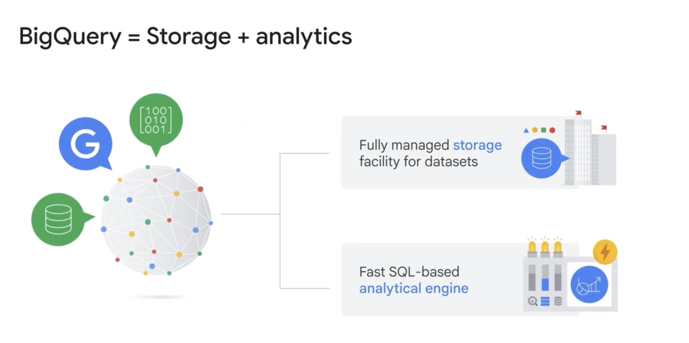
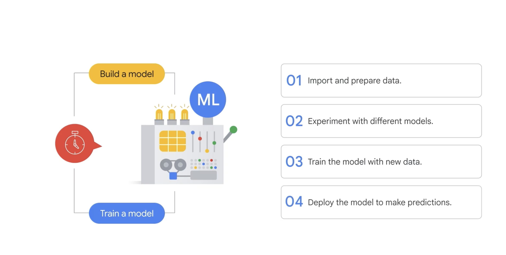
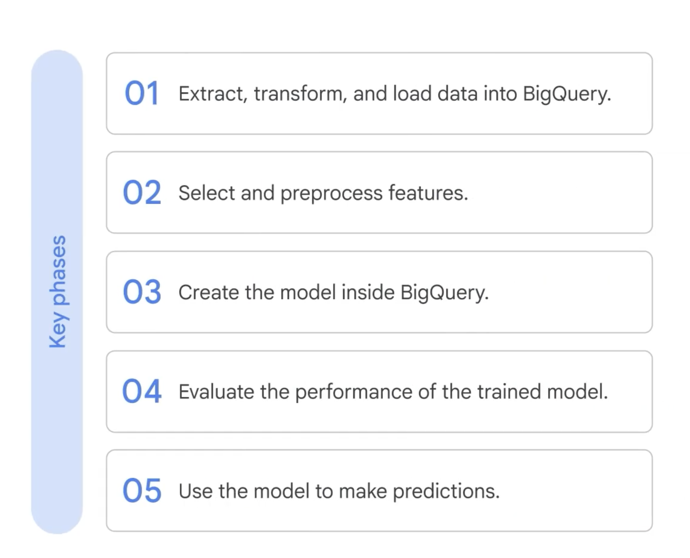

# Note: Building Machine Learning Models with BigQuery ML

## 1. What is BigQuery ML (BQML)?

BigQuery is Google Cloud’s primary data analytics tool combining two core services connected via Google's high-speed internal network:
* **Storage Facility:** Fully managed, scalable data storage.
* **SQL Analytics Engine:** Fast, distributed SQL processing engine.



## 2. Building and training ML models


This is an iterative process that requires a lot of time and resources.

## 3. **BigQuery ML (BQML)** 
Allows you to perform data analytics and execute machine learning models directly within BigQuery using standard SQL commands. This manages tabular data and ML workflows in a single place without requiring complex data pipelines.

---

### Key Features and Advantages

* **In-Situ Model Execution:** Eliminates the need to export data out of BigQuery to train models.
* **Automatic Preprocessing:** Automatically handles tasks like **One-Hot Encoding** (converting categorical string labels to numeric vectors).
* **Automated Parameter Tuning:** Simplifies model training and manages hyperparameter tuning automatically.
* **MLOps Support:** Provides built-in capabilities to help deploy, monitor, and manage models from experimentation to production.
* **Best Practice Workflow:** It is recommended to start with baseline models (like Linear or Logistic Regression) before escalating to complex architectures like Deep Neural Networks (DNN).

---

### BQML Model Support Overview

| Model Category | Problem Type | Supported Models / Algorithms |
| :--- | :--- | :--- |
| **Supervised** | Classification | `LOGISTIC_REGRESSION`, Deep Neural Networks (DNN) |
| **Supervised** | Regression | `LINEAR_REGRESSION`, Deep Neural Networks (DNN) |
| **Unsupervised** | Clustering | `KMEANS` |
| **Time Series** | Forecasting | Time series models (e.g., ARIMA) |

---

## 4. The 5 Phases of a BQML Project Workflow



### Phase 1: Extract, Transform, Load (ETL)
Load data into BigQuery using native GCP connectors (e.g., YouTube) or SQL `JOIN` queries to enrich datasets.

### Phase 2: Feature Selection & Preprocessing
Prepare training data using standard SQL. BQML handles routine feature processing, such as one-hot encoding categorical variables automatically. One-hot encoding converts your categorical data into numeric data that is required by a training model.

### Phase 3: Create and Train the Model (`CREATE MODEL`)
Train your model directly using SQL statements.

```sql
CREATE OR REPLACE MODEL `ecommerce.classification`
OPTIONS(
  model_type='LOGISTIC_REGRESSION',
  input_label_cols=['will_buy_in_future']
) AS
SELECT
  feature1,
  feature2,
  will_buy_in_future
FROM
  `ecommerce.training_data`;
```

### Phase 4: Evaluate Model Performance (`ML.EVALUATE`)
Evaluate the trained model against an evaluation dataset to assess metrics like accuracy, precision, and recall.

```sql
SELECT
  roc_auc,
  accuracy,
  precision,
  recallIntroduction_to_AI_and_Machine_Learning_on_Google_Cloud/02_BigQueryML.md
FROM
  ML.EVALUATE(
    MODEL `ecommerce.classification`,
    (SELECT * FROM `ecommerce.eval_data`)
  );
```

### Phase 5: Make Predictions (`ML.PREDICT`)
Run inference on new data. BQML returns predictions alongside confidence scores, appending `predicted_<label_name>` to your output fields.

```sql
SELECT
  *
FROM
  ML.PREDICT(
    MODEL `ecommerce.classification`,
    (SELECT * FROM `ecommerce.new_data`)
  );
```

---

## 5. SQL Command Cheat Sheet

* `CREATE MODEL`: Defines model parameters (model_type, label column) and begins training.
* `ML.EVALUATE`: Evaluates model performance metrics against evaluation datasets.
* `ML.PREDICT`: Generates predictions and probability confidence scores on target datasets.